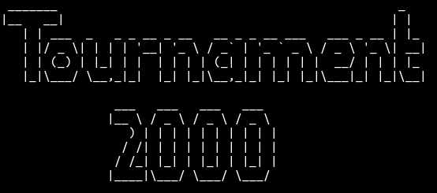
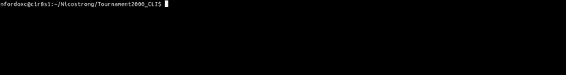
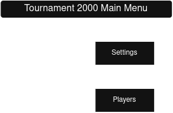
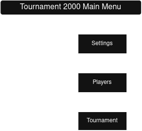
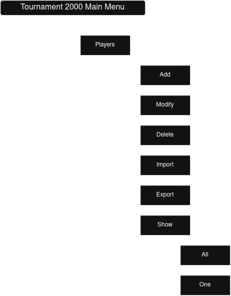
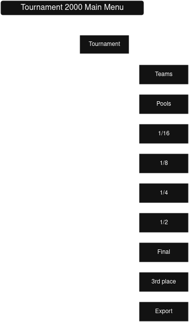
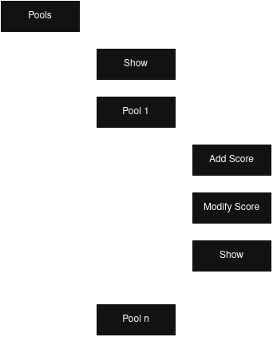
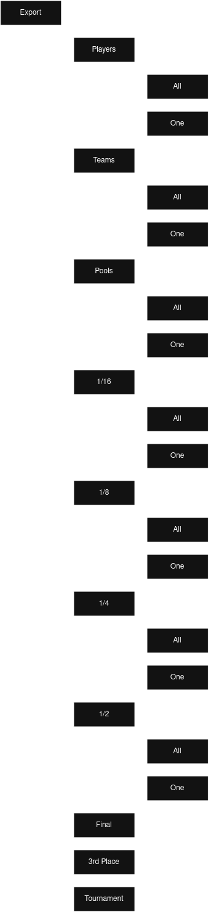
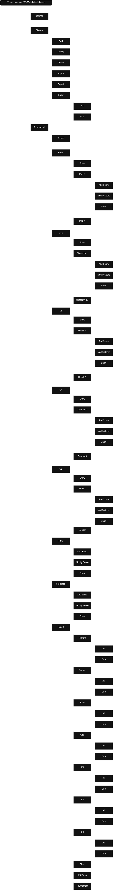

[🇫🇷 Lire en français](readme.md) | **🇬🇧 English**

# Tournament2000 (CLI)



A command-line application to manage badminton tournaments within a club.

---

## Table of Contents

+ **[Features](#features)** => All available features of the program.
+ **[Installation](#installation)** => How to install and run it.
+ **[Menus](#menus)** => Menu tree.
   + *[Players Menu](#players)*
   + *[Tournament Menu](#tournament)*
   + *[Export Menu](#export)*
+ **[Settings](#settings)** => The full power of customization.
+ **[Players](#players)* => Importing / exporting players.
+ **[Progress](#progress)** => Project progress.
+ **[Bugs](#bugs)** => In case of a bug.

---

## Features

+ Full tournament customization
+ Import / export player lists
+ Display and export results
+ ...
[back to top](#table-of-contents)

---

## Installation

1. Clone the repository:
   ```bash
   git clone git@github.com:Nicostrong/Tournament2000_CLI.git
   ```
2. Enter the cloned directory:
    ```Bash
    cd Tournament2000_CLI
    ```
3. Run the Makefile:
    ```Bash
    make
    ```
4. After compiling the program, run it:
    ```Bash
    ./Tournament2000
    ```


[back to top](#table-of-contents)

---

## Menu

> [!CAUTION] You must define the settings before launching a tournament.

> [!IMPORTANT] Some menus are accessible depending on the parameters defined in the settings.

[back to top](#table-of-contents)

---

### Main menu

When you launch the program, you see:

<p></p>

And once you have configured the settings without errors and have enough participants, you will see:

<p></p>

[back to menu](#main-menu)
[back to top](#table-of-contents)

### Players

Complete management of participants is done in the players menu.
You can enter them on the fly or import them from a CSV file.

> [!TIP] Remember to export your participants; you will only need to import them later to save time.

<p></p>

[back to menu](#main-menu)
[back to top](#table-of-contents)

### Tournament

This menu becomes active as soon as the settings are correct and there are enough participants to start a tournament.

<p></p>

This menu also contains submenus that will become active as the tournament progresses.

The ***Team*** menu allows you to display the different teams.
The ***Pools*** menu manages the group stage matches.
The ***1***/16 menu manages the round of 32 matches (visible under specific conditions).
The ***1***/8 menu manages the round of 16 matches (visible under specific conditions).
The ***1***/4 menu manages the quarter-final matches (visible under specific conditions).
The ***1***/2 menu manages the semi-final matches (visible under specific conditions).
The ***Final*** menu manages the final match (visible under specific conditions).
The ***3rd*** place menu manages the third-place match (visible under specific conditions).
The ***Export*** menu manages all possible exports.

For the different phases of the tournament, each menu shares the same submenu to manage the current stage.

<p></p>

[back to menu](#main-menu)
[back to top](#table-of-contents)

### Export

> [!NOTE] This menu allows you to export almost all data related to the tournament.

<p></p>

### Full tree structure

<p></p>

[back to menu](#main-menu)
[back to top](#table-of-contents)

---

## Settings

Here is the list of settings that must be configured:

> [!WARNING] A checker verifies the logic of the settings. For instance, if you want a 12-player tournament, it goes without saying that it cannot be played in doubles.

### Tournament configuration

+ Tournament title

### Player settings

+ Total number of participants [12:92]
+ Doubles tournament [y/n]
+ Mixed tournament [y/n]

> [!TIP] If you are not sure you will have enough participants, this option allows players to play in multiple teams.

+ Multi-team player [y/n]

### Pool settings

+ Number of pools [4/8/16]
+ Number of players / teams per pool [3:8]

### Match settings

+ Number of available courts [1:12]
+ Score to win a set [5:30]
+ Maximum score to win a set [5:30]
+ Required point gap [1:5]

### Stage settings

+ Number of sets in pool stage [1:3]
+ Number of sets in round of 32 [1:3]
+ Number of sets in round of 16 [1:3]
+ Number of sets in quarter-finals [1:3]
+ Number of sets in semi-finals [1:3]
+ Number of sets in final [1:5]
+ 3rd place match [y/n]
+ Number of sets in 3rd place match [1:3]


[back to top](#table-of-contents)

---

## Progress

- [x] Define the different program classes.
- [x] Define relationships between classes.
- [x] Implement tournament business logic.
- [x] Implement player import and export.
- [x] Implement menus.
- [x] Implement displays for tournament stages.
- [x] Implement exports for tournament stages.
- [ ] Handle conditional display linked to settings.
- [ ] Handle conditional display linked to tournament progress.
- [ ] Test with Valgrind.

[back to top](#table-of-contents)

---

## Bugs

> [!CAUTION] Perfection does not exist. If you encounter an issue, please feel free to open a PR.