🇫🇷 [Lire en Français](readme.md) | 🇬🇧 **English**

# Tournament2000 (CLI)

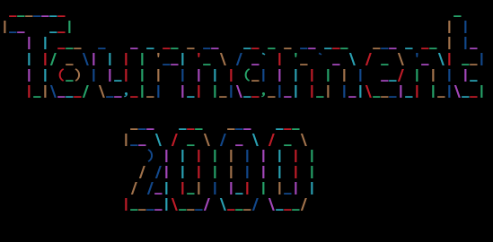

A command-line application to manage a fully customizable sports tournament.

---

## Table of Contents

+ **[Features](#features)** => All available features of the program.
+ **[Installation](#installation)** => How to install and run it.
+ **[Launch](#launch)**
   + *[Settings](#settings)* => Configuring the settings.
   + *[Players](#players)* => Registering the players.
   + *[Tournament](#tournament)* => Starting the tournament.
      - *[Teams](#teams)* => Team management.
      - *[Pools](#pools)* => Pool match management.
      - *[Matches](#matches)* => Match management.
      - *[Export](#export)* => Export management.
      - *[Import](#import)* => Import management.
      - *[Show](#show)* => Display management for different phases and elements.
+ **[Future Improvements](#future-improvements)** => Project progress.
+ **[Bugs](#bugs)** => In case of bugs.

---

## Features

+ Choice of match type (singles / doubles)
+ Choice of gender mix (single-gender / mixed)
+ Fine-tuning of group stage matches
+ Fine-tuning of intermediate stage matches
+ Final match configuration
+ Third-place match configuration
+ Player list import / export
+ Display and export of results
+ Team disqualification system

*[back to top](#table-of-contents)*

---

## Installation

1. Clone the repository:
   ```bash
   git clone git@github.com:Nicostrong/Tournament2000_CLI.git
   ```
2. Enter the cloned directory:
   ```bash
   cd Tournament2000_CLI
   ```
3. Execute the Makefile:
   ```bash
   make
   ```
4. After the program is compiled, run it:
   ```bash
   ./Tournament2000
   ```

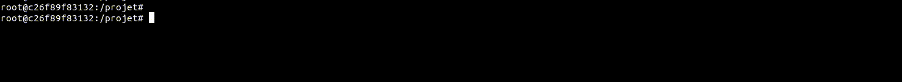

*[back to top](#table-of-contents)*

---

## Launch

> [!CAUTION] When you launch the program, you are prompted to configure the tournament settings.

> [!IMPORTANT] The settings are immutable. A summary is presented to you at the end of the settings configuration for validation. Once validated, it is impossible to modify the settings.

Here are the steps to follow to launch a tournament:

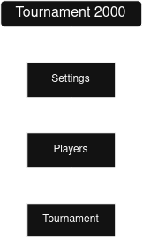

*[back to top](#table-of-contents)*

### Settings

When you launch the program, you are prompted to configure the settings. Here are the different parameters to provide during this step:

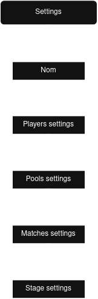

And once you have configured the settings without errors, the program will display a settings summary. If you want to make changes, just say "No", otherwise you will move on to the next step.

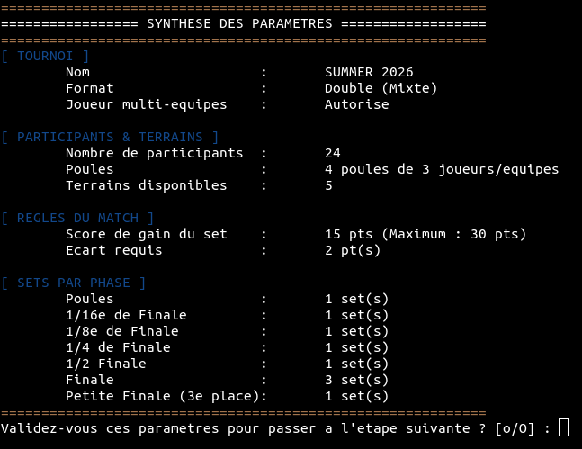

*[back to top](#table-of-contents)*

### Players

Here is the step where you register the players to participate in the tournament. The number of players as well as their gender are defined in the settings.

The Players menu is dynamic, meaning it will only display the actions possible at time T.

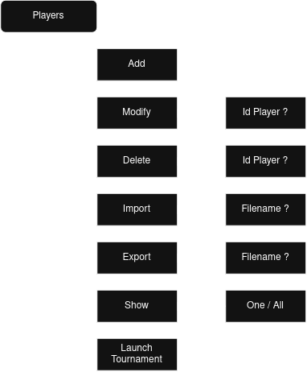

The **Add** menu allows you to register a player manually.
The **Modify** and **Delete** menus display the list of already registered players and ask you to enter the ID of the player you want to modify/delete.
The **Import** and **Export** menus ask for the path of the file to read or create.

> [!NOTE] Remember to export your participants; you will only need to import them to save time.

The **Show** menu allows you to display one or all already registered players.

> [!NOTE] The program automatically handles multiple imports while respecting the settings parameters.

> [!NOTE] Importing will not add more players than defined in the settings.

> [!NOTE] Importing respects the settings for both the number of players and gender.

*[back to top](#table-of-contents)*

### Tournament

Finally, you are at the heart of the program: the *tournament*. The **Tournament** menu seems quite large and complex, but in reality, it is dynamic, so it will evolve as the tournament progresses.

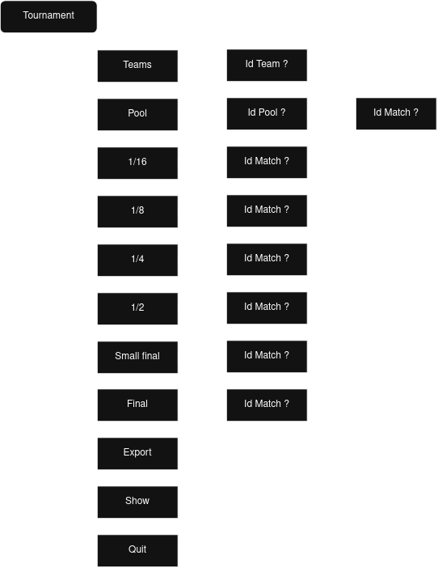

#### Teams

After entering the ID of the team you want to interact with, this menu will appear:

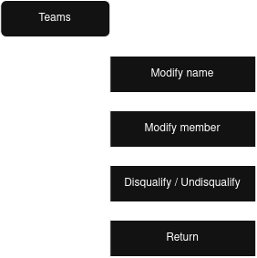

In the **Teams** menu you can rename the default team name, modify a member, or disqualify it. 

*[back to Tournament menu](#tournament)*
*[back to top](#table-of-contents)*

#### Pools

After entering the ID of the pool you want to interact with, the program displays a table with all the matches that need to be played.
 
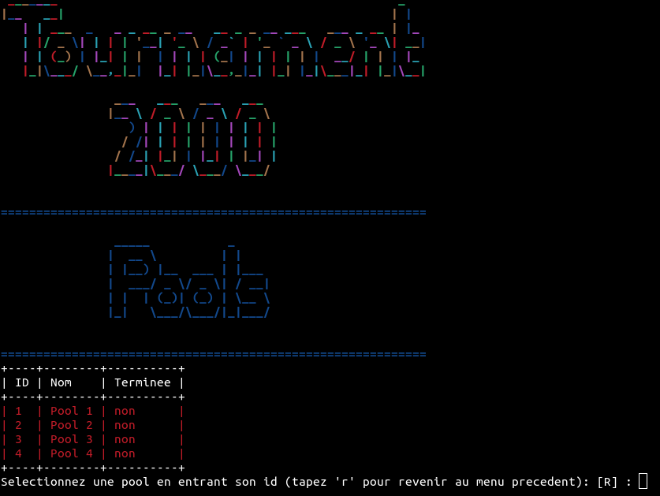

#### Matches

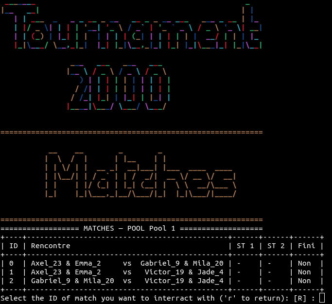

*here, the matches of pool 1* 

After selecting the ID of the match you want to interact with, you have this menu which allows you to enter the match score or modify it in case of an error.

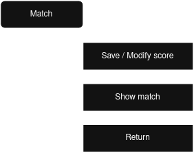

> [!note] In all phases of the tournament, there is the same logic for scorekeeping.

*[back to Tournament menu](#tournament)*
*[back to top](#table-of-contents)*

### Export

A tournament management program without the ability to export various data is not really a tournament management program.

In this menu you will have the possibility to export different data in various formats (csv, txt).

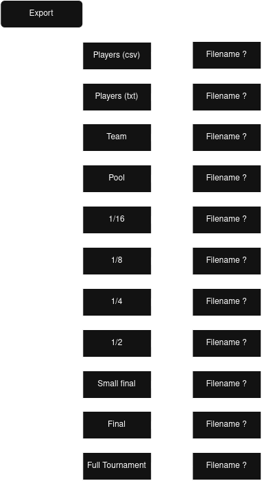

> [!NOTE] For each menu, you will be asked for the name of the output file in which the data will be saved.

> [!NOTE] Additionally, this menu is dynamic, so you will only be able to export what is possible.

#### Show

I added this menu to test the different visuals of the program and I kept it because it can be interesting for visualization during the tournament or even at the end.

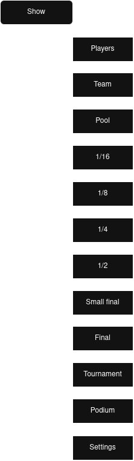

> [!note] This menu is dynamic, so it will only display what is possible to be displayed.

*[back to menu](#launch)*
*[back to top](#table-of-contents)*

---

## Future Improvements

> [!NOTE] Software is alive and constantly evolving, which is why I will list all future program improvements here.

+ Multi-language support
+ ...

*[back to top](#table-of-contents)*

---

## Bugs

> [!note] Perfection does not exist, so if you encounter a problem, please open an *[ISSUE](https://github.com/Nicostrong/Tournament2000_CLI/issues)*

> [!tip] If you have ideas for improvements, it will be a pleasure to implement them to make this program as versatile as possible.

*[back to top](#table-of-contents)*
